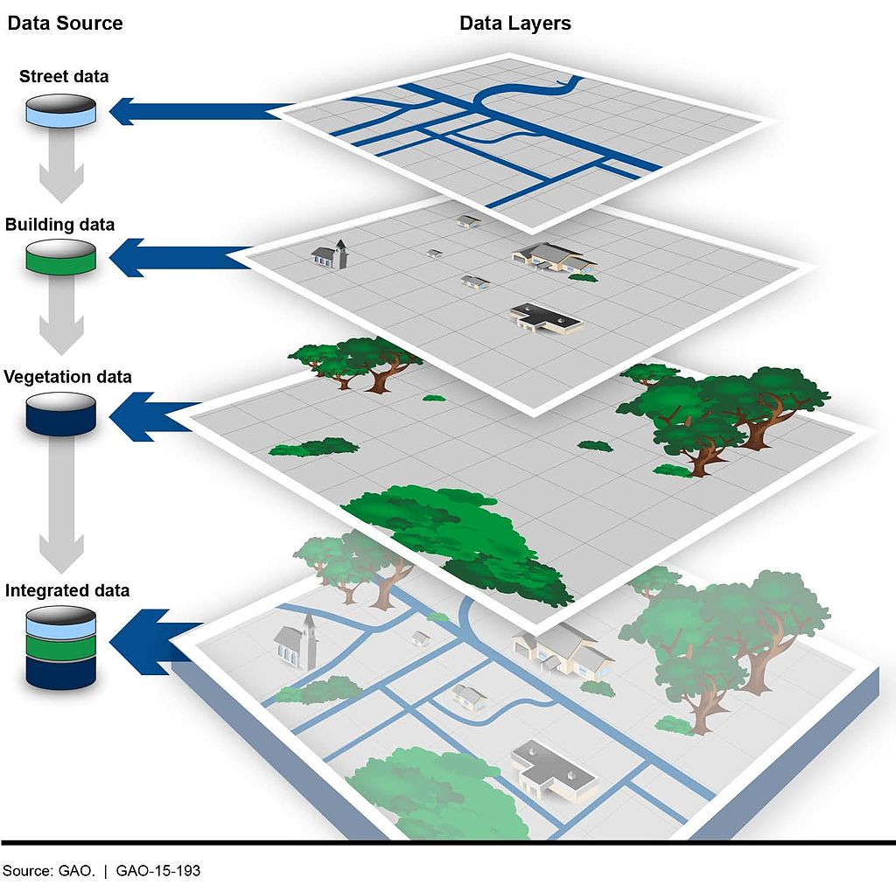

```{r setup, include=FALSE}
knitr::opts_chunk$set(echo = TRUE)
```

## Chapter 29

Up to now, we've been looking at patterns in data for what is more than this, or what's the middle look like. We've calculated metrics like per capita rates, or looked at how data changes over time.

Another way we can look at the data is geographically. Is there a spatial pattern to our data? Can we learn anything by using distance as a metric? What if we merge non-geographic data into geographic data?

The bad news is that there isn't a One Library To Rule Them All when it comes to geo queries in R. But there's one emerging, called Simple Features, that is very good.

Go to the console and install it with `install.packages("sf")`

To understand geographic queries, you have to get a few things in your head first:

1.  Your query is using planar space. Usually that's some kind of projection of the world. If you're lucky, your data is projected, and the software will handle projection differences under the hood without you knowing anything about it.
2.  Projections are cartographers making opinionated decisions about what the world should look like when you take a spheroid -- the earth isn't perfectly round -- and flatten it. Believe it or not, every state in the US has their own geographic projection. There's dozens upon dozens of them.
3.  Geographic queries work in layers. In most geographic applications, you'll have multiple layers. You'll have a boundary file, and a river file, and a road file, and a flood file and combined together they make the map. But you have to think in layers.
4.  See 1. With layers, they're all joined together by the planar space. So you don't need to join one to the other like we did earlier -- the space has done that. So you can query how many X are within the boundaries on layer Y. And it's the plane that holds them together.

```{r, echo=FALSE}

```

## Importing and viewing data

Let's start with the absolute basics of geographic data: loading and viewing. Load libraries as usual.

### Task 1: Load packages

**Task** Run the following code to load packages.

```{r}
library(tidyverse)
library(sf)
library(janitor)
```

First: an aside on geographic data. There are many formats for geographic data, but data type you'll see the most is called the shapefile. It comes from a company named ERSI, which created the most widely used GIS software in the world. For years, they were the only game in town, really, and the shapefile became ubiquitous, especially so in government and utilities.

More often than not, you'll be dealing with a shapefile. But a shapefile isn't just a single file -- it's a collection of files that combined make up all the data that allow you to use it. There's a .shp file -- that's the main file that pulls it all together -- but it's important to note if your shapefiles has a .prj file, which indicates that the projection is specified. You also might be working with a GeoDatabase, or a .gdb file. That's a slightly different, more compact version of a Shapefile.

The data we're going to be working with is a Shapefile of Maryland zip codes from the [state's GIS data catalog](https://data.imap.maryland.gov/datasets/38f3f8bc61bb4261b59d71b3642e3cd6_3/explore?location=38.810313%2C-77.268250%2C8.83).

### Task: Load the Maryland zip code map data.

Similar to `readr`, the `sf` library has functions to read geographic data. In this case, we're going to use `st_read` to read in our zip code data. And then glimpse it to look at the columns.

### Task: Load data

**Task** Run the following code to load data. Describe what you see in the answer space below. What columns exist in this data? **Answer** The columns in this shapefile are the object id, zip code, zip name, shape length and shape area. 

```{r}
md_zips <- st_read("data/md_zips/BNDY_ZIPCodes11Digit_MDP.shp")

glimpse(md_zips)
```

This looks like a normal dataframe, and mostly it is. We have one row per zipcode, and each column is some feature of that zip code: the fipscode, name and more. What sets this data apart from other dataframes we've used is the last column, "geometry", which is of a new data type. It's not a character or a number, it's a "Multipolygon", which is composed of multiple longitude and latitude values. When we plot these on a grid of latitude and longitude, it will draw those shapes on a map.

Let's look at these zip codes We have 526 of them, according to this data.

### Task: Run code

**Task** Run the following code. Describe the output in the space below: what kind of information does it contain? **Answer**

There is a column name for geometry, zip name, and then there are two zip codes labeled as zip1 and zip2.  
```{r}
View(md_zips)
```

But where in Maryland are these places? We can simply plot them on a longitude-latitude grid using ggplot and geom_sf.

### Task: Run code

**Task** Run the following code. Describe the output in the space below. **Answer** 

THe output of this code displays the state of Maryland and its counties on a longitudinal and latitudinal axis. 

```{r}
md_zips |>
  ggplot() +
  geom_sf() +
  theme_minimal()
```

Each shape is a zip code, with the boundaries plotted according to its degrees of longitude and latitude.

If you know anything about Maryland, you can pick out the geographic context here. You can basically see where Baltimore is and where the borders of the District of Columbia touch Maryland. But this map is not exactly ideal. It would help to have a county map layered underneath of it, to help make sense of the spatial nature of this data.

This is where layering becomes more clear. First, we want to go out and get another shapefile, this one showing Maryland county outlines.

Instead of loading it from our local machine, like we did above, we're going to use a package to directly download it from the U.S. Census. The package is called `tigris` and it's developed by the same person who made `tidycensus`.

In the console, install tigris with `install.packages('tigris')`

Then load it:

### Task: Run code

**Task** Run the following code. Describe the output in the space below. **Answer**

```{r}
# install.packages('tigris')
library(tigris)
```

Now, let's use the counties() function from tigris to pull down a shapefile of all U.S. counties.

### Task: Run code

**Task** Run the following code. Describe the output in the space below. **Answer**  In the results below, there are numerous columns with county information, such as a GEOID, GEOIDFQ, name, CountyFP and countyNS. There is also a geometry column. 

```{r}

counties <- counties()

glimpse(counties)
```

This looks pretty similar to our places shapefile, in that it looked mostly like a normal dataframe with the exception of the new geometry column (this time called `geometry`, which is pretty common).

This county shapefile has all 3233 U.S. counties. We only want the Maryland counties, so we're going to filter the data to only keep Maryland counties. There is no STATE column, but there is a STATEFP column, with each number representing a state. Maryland's FP number is 24.

### Task: Run code

**Task** Run the following code. Describe the output in the space below. **Answer**

The output of this code still has some of the same columns from the previous counties dataframe, such as a GEOID and name, but this dataframe filters only for Maryland counties. 

```{r}
md_counties <- counties |>
  filter(STATEFP == "24")

```

To see what this looks like, let's plot it out with ggplot. We can pretty clearly see the shapes of Maryland counties.

### Task: Run code

**Task** Run the following code. Describe the output in the space below. **Answer**

In this code, the ggplot shows the Maryland counties; however, the results in this task are much different from the previous map, in which the counties are cleaner and does not display the zip codes. 

```{r}
md_counties |>
  ggplot() +
  geom_sf() +
  theme_minimal()
```

With this county map, we can layer our places data.

Something to note: The layers are rendered in the order they appear. So the first geom_sf is rendered first. The second geom_sf is rendered ON TOP OF the first one.

We're also going to change things up a bit to put the datasets we want to display INSIDE of the geom_sf() function, instead of starting with a dataframe. We have two to plot now, so it's easier this way.

### Task: Run code

**Task** Run the following code. Describe the output in the space below. **Answer**

The results of this code shows the Maryland counties plus the Maryland zip codes over top of each other, this code also includes the outline of the Potomac? There also seems to be more of a border on this map compared to the previous zip code map. 

```{r}
ggplot() +
  geom_sf(data=md_counties) +
  geom_sf(data=md_zips) +
  theme_minimal()
```

Notice the subtle differences at the boundaries?

Now let's do something more interesting with geographic data. We're going to figure out which churches from our statewide churches data are located in Prince George's County -- and then map them. But our churches data doesn't have a county column. It only has zip codes. So how do we figure out which zip codes are in Prince George's County?

This is where the power of geographic data comes in. We already have a zip code shapefile with the geographic boundaries of each zip code, and we can get the geographic boundary of Prince George's County from our county data. Using a **spatial join**, we can find which zip codes overlap with Prince George's County -- no county column needed. The geography itself connects the two datasets.

### Task: Load the Maryland churches data

**Task** Run the following code. Describe the output in the space below. **Answer** The following code loads in the Maryland churches dataframe and gives a glimpse of the columns within it. 

```{r}
md_churches <- read_csv("data/churches_md.csv")

glimpse(md_churches)
```

This is a dataframe of churches registered as tax-exempt organizations in Maryland. It has columns for the church name, address, city, state, zip code, and NTEE code (a classification system for nonprofits). Notice the `zip5` column -- that's the 5-digit zip code we can use to connect this data to our zip code shapefile.

### Task: Use a spatial join to find Prince George's County zip codes

First, we need to filter our county data down to just Prince George's County. Then we'll use `st_join()` to find which zip codes from our shapefile intersect with the county boundary. We need to make sure both layers use the same coordinate reference system (CRS), so we'll transform the county data to match the zip code data's CRS.

**Task** Run the following code. Describe the output in the space below. **Answer** First, the code filters the Maryland counties dataframe to only Prince George's county. Then, the code joins the md_zips and pg_county dataframe together using st_join. Overall, the new dataframe, pg_zips, shows the combination of the two dataframes for Prince George's County. 

```{r}
pg_county <- md_counties |>
  filter(NAME == "Prince George's") |>
  st_transform(crs = st_crs(md_zips))

pg_zips <- st_join(md_zips, pg_county, join = st_intersects) |>
  filter(!is.na(NAME))

pg_zips
```

The `st_join()` function checks which zip code polygons intersect (overlap with) the Prince George's County polygon. Zip codes that fall outside PG County will have NA values for the county columns, so we filter those out. The result is a set of zip codes that are in Prince George's County.

### Task: Filter churches to Prince George's County

Now we can use those PG County zip codes to filter our churches data. We'll match the `zip5` column in the churches data to the `ZIPCODE1` column in our spatial join results.

**Task** Run the following code. Describe the output in the space below. How many churches are in Prince George's County? **Answer** From the code below, we are able to find the amount of churches in Prince George's County. This line of code also turns the zip5 column to a character datatype rather than numeric. According to the results of the code, there are 2120 churches in Prince George's County. 

```{r}
pg_churches <- md_churches |>
  mutate(zip5 = as.character(zip5)) |>
  filter(zip5 %in% pg_zips$ZIPCODE1)

nrow(pg_churches)
```

### Task: Count churches per zip code

Now let's count how many churches are in each PG County zip code and join that count back to the zip code shapefile. This will let us make a choropleth map -- where the color of each zip code represents the number of churches in it.

**Task** Run the following code. Describe the output in the space below. **Answer** The first line of code counts the amount of churches within each zip code. Then it joins the pg_zips and pg_churches_counts together so we can create a map. 

```{r}
pg_church_counts <- pg_churches |>
  group_by(zip5) |>
  summarise(church_count = n())

pg_churches_sf <- pg_zips |>
  left_join(pg_church_counts, by = c("ZIPCODE1" = "zip5"))

pg_churches_sf
```

### Task: Plot the choropleth

Now let's plot the zip code choropleth on top of the Prince George's County boundary. The `fill` aesthetic will color each zip code by its church count.

**Task** Run the following code. Describe the output in the space below. What spatial patterns do you notice? Which zip codes have the most churches? **Answer** From the results of the code, there is a map of Prince George's County and it is filled with color depending on the amount of churches within each part of the county. The biggest spatial pattern that I notice is that the east side of Prince George's County seems to have the least amount of churches within the entire county.  

```{r}
ggplot() +
  geom_sf(data=pg_county) +
  geom_sf(data=pg_churches_sf, aes(fill=church_count)) +
  scale_fill_viridis_b(option="magma") +
  theme_minimal() +
  labs(title="Churches in Prince George's County by Zip Code",
       fill="Number of\nChurches")
```

You should see the outline of Prince George's County with each zip code colored according to how many churches it contains. Are they evenly distributed? Are there clusters? Think about what you know about the county's geography -- where are the more densely populated areas?

This is a common pattern in data journalism: using spatial joins to connect non-geographic data (like our churches list) to geographic boundaries, and then mapping the results as a choropleth. The key insight is that you don't always need latitude and longitude coordinates to map data -- sometimes a shared geographic identifier like a zip code, combined with a shapefile, is enough.

## Chapter 21

In the previous chapter, we looked at churches in Prince George's County as point data. Now let's zoom out and look at patterns of religious adherence across all Maryland counties using a choropleth map -- a map where the color of each geographic area represents a data value.

First, let's load the libraries we'll need. We're also going to load tidycensus and set an API key for tidycensus.

### Task: Load libraries

**Task** Run the following code. Describe the output in the space below. Be sure to input your census api key. **Answer**

```{r}
library(tidyverse)
library(sf)
library(janitor)
library(tidycensus)
```

For the rest of this chapter, we're going to work on building a map that will help us gain insight into geographic patterns in religious adherence by county in Maryland. What geographic patterns can we identify?

First, we'll load the county-level religion data from the U.S. Religion Census 2020, which includes the number of congregations and adherents for each Maryland county. We'll also get population data for each county using tidycensus. The variable for total population is B01001_001.

### Task: Run code

**Task** Run the following code. Describe the output in the space below. **Answer**

```{r}
md_county_religion <- read_csv("data/md_religion_choropleth.csv")

md_county_population <- get_acs(geography = "county",
              variables = c(population = "B01001_001"),
              year = 2021,
              state = "MD")
```

Ultimately, we're going to join this county table with population data to the religion data by county, and then calculate a per-capita rate. But remember, we then want to visualize this data by drawing a county map that helps us pick out trends. Thinking ahead, we know we'll need a county map shapefile. Fortunately, we can pull this geometry information right from tidycensus at the same time that we pull in the population data by adding "geometry = TRUE" to our get_acs function.

### Task: Run code

**Task** Run the following code. Describe the output in the space below. **Answer**

```{r}
md_county_population <- get_acs(geography = "county",
              variables = c(population = "B01001_001"),
              year = 2021,
              state = "MD",
              geometry = TRUE)

md_county_population
```

We now have a new column, geometry, that contains the "MULTIPOLYGON" data that will draw an outline of each county when we go to draw a map.

The next step will be to join our population data to our religion data on the county column.

But there's a problem. The column in our population data that has county names is called "NAME", and it has the full name of the county spelled out in title case -- first word capitalized and has "County" and "Maryland" in it. The religion data just has the name of the county. For example, the population data has "Anne Arundel County, Maryland" and the religion data has "Anne Arundel County".

### Task: Run code

**Task** Run the following code. Describe the output in the space below. **Answer** The below code shows the md_county_relgion columns. 


```{r}
md_county_population

md_county_religion
```

If they're going to join properly, we need to clean one of them up to make it match the other.

Let's clean the population table. We're going to rename the "NAME" column to "county", then remove ", Maryland" and make the county titlecase. Next we'll remove any white spaces after that first cleaning step that, if left in, would prevent a proper join. We're also going to rename the column that contains the population information from "estimate" to "population" and select only the county name and the population columns, along with the geometry. That leaves us with this tidy table.

### Task: Run code

**Task** Run the following code. Describe the output in the space below. **Answer** First, the code renames the "NAME" column in the md_county_population to be county like the md_county_religion column. The second line of code makes all of the county names in the md_county_population title case and also removes ", Maryland" from the end of each county name. The third and fourth line of code removes any blank space in the county names, and renames the column population to estimate. Finally, it selects the county, population and geometry columns. 

```{r}
md_county_population <- md_county_population |>
  rename(county = NAME) |>
  mutate(county = str_to_title(str_remove_all(county,", Maryland"))) |>
  mutate(county = str_trim(county,side="both")) |>
  rename(population = estimate) |>
  select(county, population, geometry)

md_county_population
```

Now we can join them. We'll need to make sure the county names match. Let's check the religion data column name:

### Task: Run code

**Task** Run the following code. Describe the output in the space below. **Answer** This code joins the two data frames together by the county and County Name columns. 

```{r}
md_pop_with_religion <- md_county_population |>
  left_join(md_county_religion, join_by(county == `County Name`))

md_pop_with_religion
```

Our final step before visualization, let's calculate the number of congregations per 10,000 population and sort from highest to lowest to see what trends we can identify just from the table.

### Task: Run code

**Task** Run the following code. Describe the output in the space below. **Answer** In the first line of the code, the two data frames are joined by the county column. Then, the second line of code calculates the rate of congregations per 10,000 population. After the calculations, the code orders the values in descending order. 

```{r}
md_pop_with_religion <- md_county_population |>
  left_join(md_county_religion, join_by(county == `County Name`)) |>
  mutate(rate = Congregations/population*10000) |>
  arrange(desc(rate))

md_pop_with_religion
```

Let's take a look at the result of this table. The variances in the rates are notable: some rural counties have significantly higher rates of congregations per capita than more suburban or urban counties. Think about why that might be -- smaller communities often have more churches per person than large ones.

Okay, now let's visualize. We're going to build a choropleth map, with the color of each county -- the fill -- set according to the number of congregations per 10K population on a color gradient.

### Task: Run code

**Task** Run the following code. Describe the output in the space below. **Answer** The results of this following code shows a chloropleth map of the Maryland counties that fills in the counties based on the congregations per 10k population. One interesting pattern that I notice from the map is that the middle counties within the map seem to have the lowest number of congregations per 10k, while the more eastern counties have higher numbers of congregations per 10k population. 

```{r}

county_centroids <- st_centroid(md_counties)
county_centroids_df <- as.data.frame(st_coordinates(county_centroids))
county_centroids_df$NAME <- county_centroids$NAME

ggplot() +
  geom_sf(data=md_pop_with_religion, aes(fill=rate)) +
  geom_text(aes(x = X, y = Y, label = NAME), data = county_centroids_df, size = 3, check_overlap = TRUE) +
  theme_minimal()
```

This map is okay, but the color scale makes it hard to draw fine-grained differences. Let's try applying the magma color scale we learned in the last chapter.

### Task: Run code

**Task** Run the following code. Describe the output in the space below. **Answer** The output of this code changes the colors of the fill for each county. This enables us to see the county boundaries better; however, now the labels for each county are gone. 

```{r}
ggplot() +
  geom_sf(data=md_pop_with_religion, aes(fill=rate)) +
  theme_minimal() +
  scale_fill_viridis_b(option="magma")
```

The highest ranking counties stand out nicely in this version, but it's still hard to make out fine-grained differences between other counties.

So let's change the color scale to a "log" scale, which will help us see those differences a bit more clearly.

### Task: Run code

**Task** Run the following code. Describe the output in the space below. What regional patterns do you see? **Answer** This code changes the color fills slightly, which helps with the visibility of the highest rated county. One of the regional patterns that I notice from the map is that the more urban counties seem to have the lowest values of congregations per 10k population. As you go further south, there seems to be more congregations per 10k population. 

```{r}
ggplot() +
  geom_sf(data=md_pop_with_religion, aes(fill=rate)) +
  theme_minimal() +
  scale_fill_viridis_b(option="magma",trans = "log")
```
